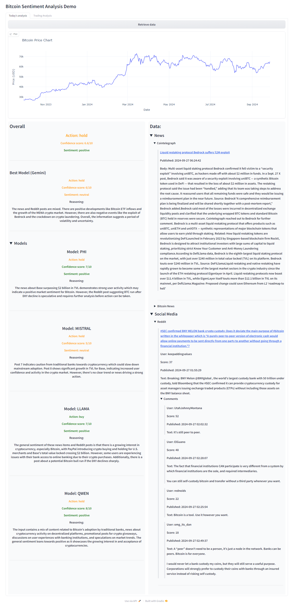
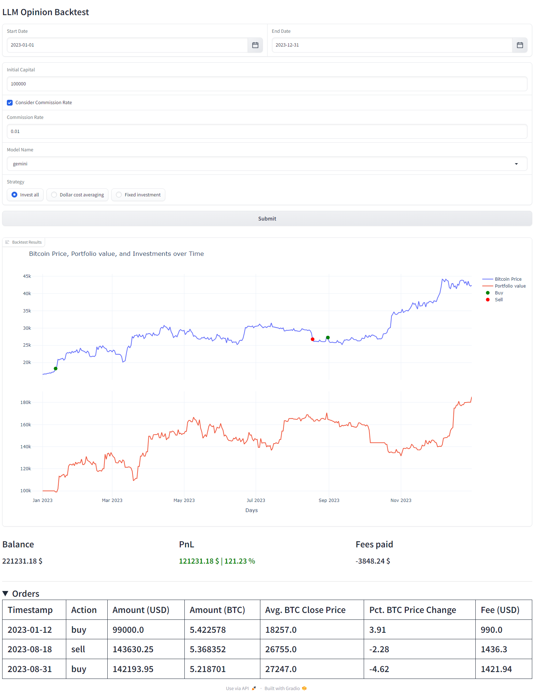

# Leveraging LLMs for Informed Bitcoin Trading Decisions: Prompting with Social and News Data Reveals Promising Predictive Abilities

The work was carried out by:

- [Danilo Corsi](https://github.com/CorsiDanilo)
- [Cesare Campagnano](https://github.com/caesar-one)

## Description
This thesis investigates the potential of leveraging Large Language Models (LLMs) to support Bitcoin traders. Specifically, we analyze the correlation between Bitcoin price movements and sentiment expressed in news headlines, posts, and comments on social media.
We build a novel, large-scale dataset that aggregates various features related to Bitcoin and its price over time, spanning from 2016 to 2024, and includes data from news outlets, social media posts, and comments.
Using this dataset, we tried to evaluate the effectiveness of LLMs and Deep Learning models by making predictions on real data through standard classification tasks, as well as backtesting and demo trading accounts with different investment strategies.
We build interactive interfaces to annotate real-time data via LLMs, perform custom backtesting, and visualize demo trading account performances.
Our approach leverages the extended context capabilities of recent LLMs through simple prompting to generate outputs such as textual reasoning, sentiment, recommended trading actions, and confidence scores. Our findings reveal that LLMs represent a powerful tool for assisting trading decisions, opening up promising avenues for future research.

## Structure
```
+- root
  +- backtest
  +- data_annotation
  +- data_exploratory_analysis
  +- data_mining
  +- data_predictions
  +- demo
  +- models
  +- shared
  +- utils
  +- config.py
  +- requirements.py
```
Where:

- `backtest`: Contains the scripts needed to backtest the strategies using the
decisions made by the LLMs.
- `data_annotation`: Contains the procedures to annotate the data using the
LLMs.
- `data_exploratory_analysis`: Contains the scripts that allow visualizing
the data collected and the decisions made by the LLMs.
- `data_mining`: Contains the procedures to retrieve all the data needed for
research and to generate a single dataset.
- `data_predictions`: Contains the scripts that allow deep learning models to
be used to make predictions based on the data collected.
- `demo`: Contains the files needed to view real-time data annotation and the
performance of demo trading accounts.
- `hf_data`: Contains all datasets collected during the retrieval, annotation, and
visualization process.
- `models`: Contains the definition of the deep learning models used during the
prediction process.
- `secrets`: Contains the secrets used within the project such as api keys and
account credentials.
- `shared: Contains variables and constants shared by most of the files in the
project.
- `utils`: Contains methods that are shared by most of the files in the project.
- `config.py: Contains the configuration variables shared by most of the files in
the project.
- `requirements.py`: Contains requirements to be installed before running the
project.

## Installation

We use Python 3.12.4 which is the last version supported by PyTorch.

1. Create an enviroment

```
python3 -m venv .venv
.venv\scripts\activate
```

2. Install requirements

```
pip install -r requirements.py
```

## Dataset
You can download the needed data from this [Hugging Face Repository](https://huggingface.co/datasets/danilocorsi/LLMs-Sentiment-Augmented-Bitcoin-Dataset/tree/main).

Put the downloaded folders into `hf_data` directory. 

The `annotated` folder contains the original dataset with the annotation of the respective LLMs.

The `merged` folder contains the raw dataset without annotation of LLMs (price data, blockchain, and sentiment indices)
 
## Demo
### Live-data annotation

**1. Setup the offline LLMs**

1.1 Download and install [Ollama](https://ollama.com/)

1.2 Setup the following LLMs:
- [LLAMA3.1](https://ollama.com/library/llama3.1)
- [MISTRAL-NEMO](https://ollama.com/library/mistral-nemo)
- [PHI3](https://ollama.com/library/phi3)
- [QWEN2](https://ollama.com/library/qwen2)

---

**2. Setup the online LLM**

2.1 Create [Gemini API Key](https://ai.google.dev/gemini-api/docs/quickstart?lang=python)

2.2 Create `gemini.json` file in the `secrets` directory and add
```
{
    "GOOGLE_API_KEY_1": "<api_key>",
}
```

---

**3. Setup the Reddit data retrival**

3.1 Create [Reddit API Key](https://old.reddit.com/prefs/apps)

3.2 Create `reddit.json` file in the `secrets` directory and add
```
{
    "client_id": "<client_id>",
    "client_secret": "<client_secret>",
    "user_agent": "<user_agent>"
}
```

---

**4. Setup the News data retrival**

4.1 Download and install [HTTP Toolkit](https://httptoolkit.com)

4.2 Set on your pc as a custom proxy:
```
ip: 127.0.0.1
port: 8080
```

---

**5. Execute the demo**

5.1 Execute `python -m demo.demo`

---

### Backtesting

1. Execute `python -m backtest.backtest`

## Examples
### Live-data annotation

### Backtesting

